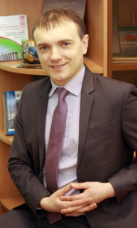

Состав участковой комиссии по выборам Президента Республики Беларусь участка для голосования № 27 Ленинского района г. Минска

Место нахождения: г. Минск, ул. Якубова, 12, государственное учреждение образования «Средняя школа № 15 г. Минска», тел. 215-05-86

**Витковская Инна Владимировна** — от Ленинской районной организации г. Минска ОО «Белорусская ассоциация многодетных родителей»  
Место работы: ТЕРРИТОРИАЛЬНЫЙ ЦЕНТРСОЦИАЛЬНОГО ОБСЛУЖИВАНИЯ НАСЕЛЕНИЯ ЛЕНИНСКОГО РАЙОНА Г.МИНСКА, Зав. отделением дневного пребывания граждан пожилого возраста

**Гулевич Наталья Фёдоровна** — от граждан путем подачи заявления  
Секретарь комиссии  
Место работы: ТЕРРИТОРИАЛЬНЫЙ ЦЕНТРСОЦИАЛЬНОГО ОБСЛУЖИВАНИЯ НАСЕЛЕНИЯ ЛЕНИНСКОГО РАЙОНА Г.МИНСКА, заместитель директора

**Ефименко Сергей Петрович** — от Минской городской организации Белорусской социально-спортивной партии  
Председатель комиссии  
Место работы: Начальник управления социальной защиты администрации Ленинского района  
 

**Ивановская Евгения Алексеевна** — от граждан путем подачи заявления  
Место работы: ТЕРРИТОРИАЛЬНЫЙ ЦЕНТРСОЦИАЛЬНОГО ОБСЛУЖИВАНИЯ НАСЕЛЕНИЯ ЛЕНИНСКОГО РАЙОНА Г.МИНСКА, Зав. отделением социальной адаптации и реабилитации

**Краснова Юлия Павловна** — от Минской городской организации Республиканской партии труда и справедливости  
Место работы: ТЕРРИТОРИАЛЬНЫЙ ЦЕНТРСОЦИАЛЬНОГО ОБСЛУЖИВАНИЯ НАСЕЛЕНИЯ ЛЕНИНСКОГО РАЙОНА Г.МИНСКА, Зав. отделением сопровождаемого проживания

**Латушкина Елена Владимировна** — от граждан путем подачи заявления

**Полесский-Щепилло Кирилл Александрович** — от Ленинской районной организации ОО «БРСМ» 
д.р. 01.08.1993, kuroschepilo@gmail.com, Тел.: +375-29-303-49-94  
https://vk.com/pol_sch  

**Свириденко Дарья Александровна** — от Ленинской районной организации г. Минска Белорусского Общества Красного Креста  
Место работы: ТЕРРИТОРИАЛЬНЫЙ ЦЕНТРСОЦИАЛЬНОГО ОБСЛУЖИВАНИЯ НАСЕЛЕНИЯ ЛЕНИНСКОГО РАЙОНА Г.МИНСКА, Зав. отделением дневного пребывания для инвалидов

**Ткачук Ольга Фёдоровна** — от Ленинской районной организации Коммунистической партии Беларуси  
Место работы: ТЕРРИТОРИАЛЬНЫЙ ЦЕНТРСОЦИАЛЬНОГО ОБСЛУЖИВАНИЯ НАСЕЛЕНИЯ ЛЕНИНСКОГО РАЙОНА Г.МИНСКА, Зав. отделением социальной помощи на дому

**Томашева Ольга Леонидовна** — от трудового коллектива ГУ «Территориальный центр социального обслуживания населения Ленинского района г. Минска»  
Заместитель председателя  
Место работы: ТЕРРИТОРИАЛЬНЫЙ ЦЕНТРСОЦИАЛЬНОГО ОБСЛУЖИВАНИЯ НАСЕЛЕНИЯ ЛЕНИНСКОГО РАЙОНА Г.МИНСКА, директор

**Финькевич Анна Викторовна** — от Ленинской районной организации РОО «Белая Русь»  
Место работы: заместитель начальника управления-начальник отдела адресной социальной помощи администрации Ленинского района  

**Хецуриани Ирина Геннадьевна** — от Ленинской районной организации ОО «Белорусский фонд мира»

**Шопик Наталья Сергеевна** — от Ленинской районной организации г. МинскаОО «Белорусский союз женщин»
